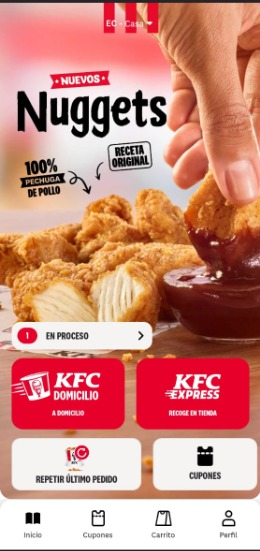
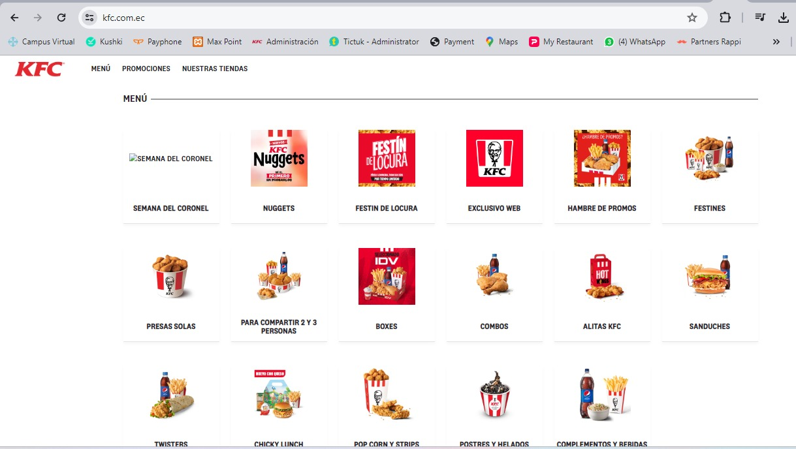
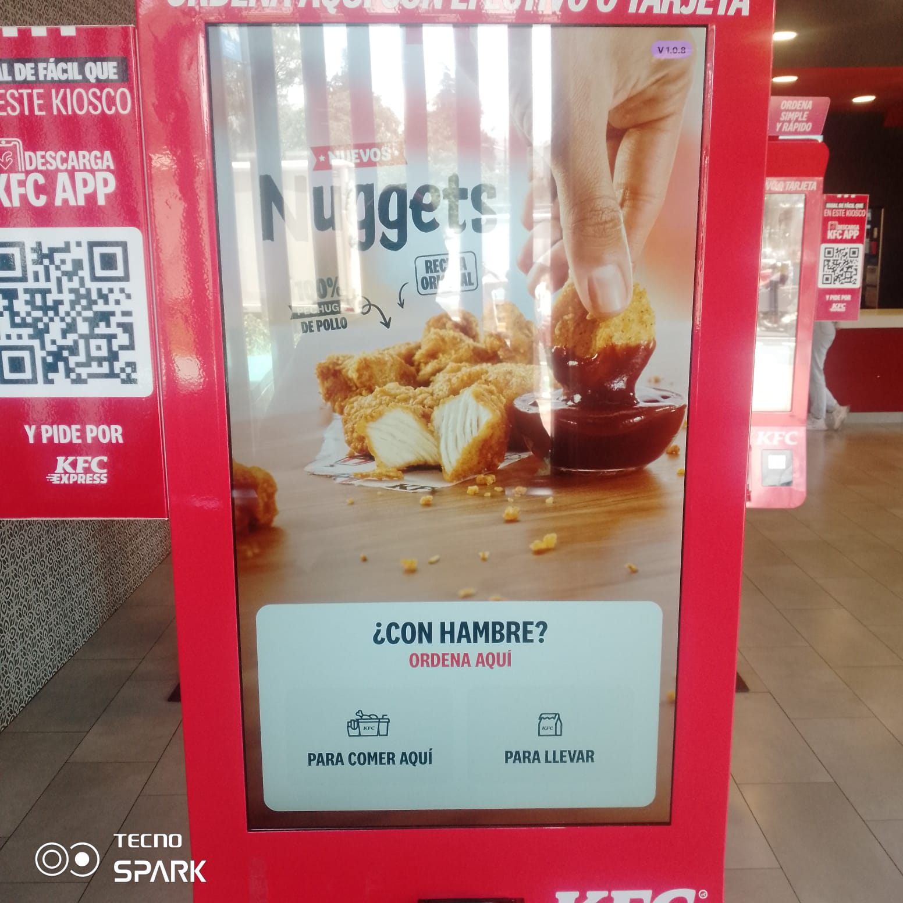
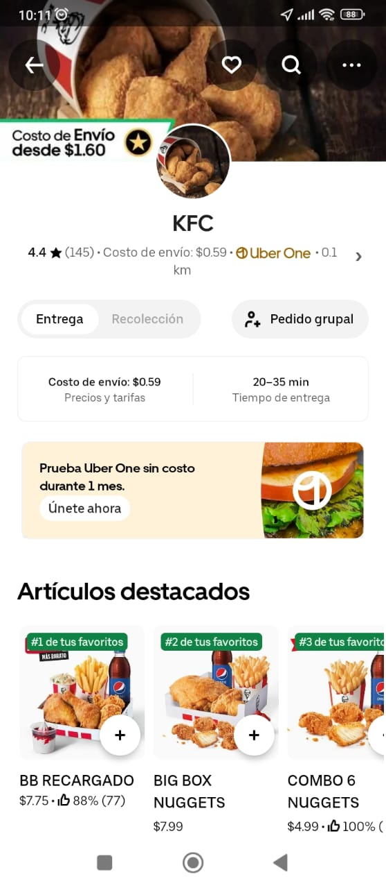
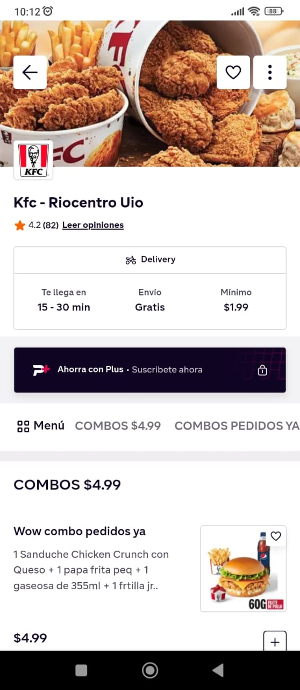
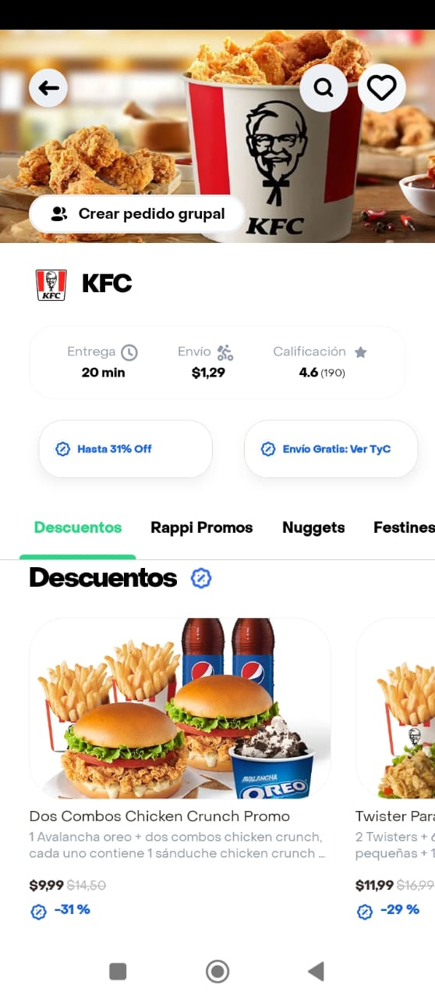

# Canales Digitales

## Qué son

Los canales digitales son plataformas en línea que facilitan la solicitud  de pedidos y entrega de alimentos directamente a la puerta del cliente.  

En nuestro sistema contamos con los siguientes:  

### App KFC Domicilio y Express

  

### PAGINA WEB D'UNA

A tráves de la pagina web:  
https://www.kfc.com.ec/  

  

### CALL CENTER  
  
  
  

### KIOSCO  
  

  

### UBER  
  
  
  

### PEDIDOS YA  
  
  
  
  

### RAPPI  
  
